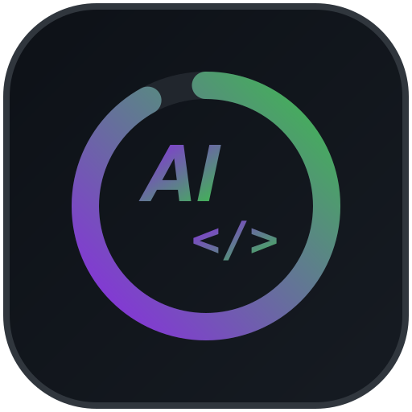

# Spooner

<p align="center">
  
</p>

<p align="center">
  <a href="README.md">English</a> | <a href="README.zh-CN.md">简体中文</a>
</p>

<p align="center">
  
  
  <a href="https://github.com/ZM-BAD/spooner/actions/workflows/ci.yml"></a>
  <a href="https://codecov.io/gh/ZM-BAD/spooner"></a>
  <a href="LICENSE"></a>
  <a href="assets/audit-report.md"></a>
</p>

> **Make this git repository ready for AI** — so AI coding agents can work in it from the first run. Audit its AI coding readiness, score it out of 10, then transform it in place: CI gates, AGENTS.md, a spec-driven workflow. Every step verifiable, never breaking the existing build.
>
> **audit → transform → check → sync** — one pipeline, no build step, zero dependencies.

<p align="center">
  <a href="assets/audit-report.md"></a>
</p>

## What Spooner does

Spooner is an [Agent Skills](https://agentskills.io/specification) (SKILL.md) package for coding agents. It scores your repository's AI readiness **/10**, installs the missing gates **in place** (never breaking the existing build), and keeps them from drifting.

An AI-native repository generally comes with complete quality gates and AI guidance: **pre-commit hooks**, **lint / formatter checks that actually run**, **CI that agrees with the local gates**, an **AGENTS.md** that tells the agent how things run, and a **spec-driven contract** (SDD templates) — to name a few. New quality gates, as they emerge, join the readiness score.

**Why the name? Spooner = Detective Del Spooner in _I, Robot_ (2004) — his left arm is robotic and serves him well. This project evaluates what your repository is missing and serves it the same way.**

The "before" is a zero-state copy of this repository — the same code, minus everything spooner installs (no AGENTS.md, no pre-commit/commitlint gates, no drift gate, no SDD workflow). One run of the pipeline takes it from **4.3/10 (AI-Aware) to 9.2/10 (AI-Native)** — a score with evidence, not an opinion ([full report](assets/audit-report.md)).

The score is on a 10-point scale, grouped into five tiers:

| Tier        | Score | What it means                                                                                   |
| ----------- | ----- | ----------------------------------------------------------------------------------------------- |
| AI-Native   | 9–10  | Ready from the first run — AGENTS.md, real gates, CI that agrees with the local hooks, no drift |
| AI-Friendly | 7–8.9 | Most facilities in place, one or two gaps left (dead hooks, CI that disagrees, no AGENTS.md)    |
| AI-Curious  | 5–6.9 | Some AI-oriented setup exists, but incomplete                                                   |
| AI-Aware    | 3–4.9 | Readable by an AI agent, nothing prepared for it                                                |
| AI-Absent   | 0–2.9 | Hard for an AI to even understand — no README, no structure, no traceable commands              |

## Quick start

Requirements: Node.js >= 22.18 and git. The audit itself works fully offline.

**Install** — one command, works for every mainstream coding agent (Claude Code, Codex, Cursor, Copilot, OpenCode, Kilo Code, Goose, Qwen Code, Kimi Code, Antigravity, TRAE, Qoder, ZCode, CodeBuddy and more):

```sh
npx skills add ZM-BAD/spooner
```

Useful flags: `-g` / `--global` (all projects), `-a` / `--agent <agent>` (target a specific agent), `-s` / `--skill <name>` (only the spooner skill). The [skills CLI](https://github.com/vercel-labs/skills) detects your agent from the environment and copies `skills/spooner/` into its skills directory. After install, list it with `/skills` in your agent session.

**Run the audit** on any repository (a deterministic health check — scores are reproducible, evidence-backed, and never a bare opinion):

```text
$ node skills/spooner/scripts/audit.ts --root /path/to/repo --format markdown

# AI-Readiness Report
- Stack: node · Maturity: stable · Score: **9.2/10**

## Score by category
| Category      | Score | Max |
| ------------- | ----- | --- |
| Agent Setup   | 4.5   | 4.5 |
| Configuration | 1.9   | 2   |
| Integrity     | 1.5   | 1.5 |
| Freshness     | 0.5   | 0.5 |
| Structure     | 0.8   | 1.5 |
```

Every gap in the report names an action the toolset actually delivers — no invented advice. Follow the report, re-run, and watch the score move.

## What you get after transform

Running `transform --stage all` installs, in place and with a pre/post build-green verification:

- **Git gates** — `.commitlintrc.json` (Conventional Commits), a stack-aware `.pre-commit-config.yaml` (lint/format/typecheck/test hooks for your stack, check-only), `.markdownlint-cli2.yaml`
- **CI** — a stack-specific `.github/workflows/ai-native.yml`: quality jobs (warn-only by default, `--gates hard` to make them hard), a declared-commands gate, a commit-msg commitlint check, and a manifest drift gate that turns CI red if templates drift
- **Agent files** — an `AGENTS.md` generated from your real commands (package.json scripts / Makefile / CI), with a `CLAUDE.md` symlink
- **SDD workflow** (optional) — `docs/sdd/` spec/plan/tasks templates + a spec-existence CI gate
- **A manifest** — `.ai-native.yml` records exactly what was installed; `check` detects drift, `sync` re-syncs when the tool advances

Every stage is verifiable and rollback-able (`git restore` of the listed files); a pre-existing broken build is reported with the reason and never blocks the install.

## The workflow

| Command     | What it does                                                                                                                  | When                                      |
| ----------- | ----------------------------------------------------------------------------------------------------------------------------- | ----------------------------------------- |
| `audit`     | Detect and score AI coding readiness (repeatable — a health check)                                                            | Any repo, anytime                         |
| `transform` | Incremental, verifiable, rollback-able transformations (stack-aware CI gates incl. the manifest drift gate / AGENTS.md / SDD) | Once per repository                       |
| `check`     | Continuously detect drift (repeatable, with records)                                                                          | Every CI run                              |
| `sync`      | Re-sync installed templates to the current tool version (version-aware, one-click)                                            | When the tool advances                    |
| `badge`     | Render a readiness badge matched to your README's badge style (5 shields styles, links to the audit report)                   | After transform, whenever the score moves |

## Stack support

| Stack                                         | detect + audit                                                                        | transform (gates + CI + AGENTS.md)       |
| --------------------------------------------- | ------------------------------------------------------------------------------------- | ---------------------------------------- |
| node (incl. React/Vue/Next)                   | ✅                                                                                    | ✅ `npm` lifecycle                       |
| python                                        | ✅                                                                                    | ✅ `python3 -m unittest discover`        |
| go                                            | ✅                                                                                    | ✅ `go build/test ./...`                 |
| java (Maven + Gradle)                         | ✅                                                                                    | ✅ `mvn -q -B test` / `gradle build`     |
| rust                                          | ✅                                                                                    | ✅ `cargo build/test` (fmt/clippy gates) |
| ruby / php / swift / dotnet / harmonyos       | ✅ (audit under-scores only)                                                          | ⚠️ cross-stack gates + explicit notice   |
| apple / c-cpp / dart-flutter / unity (Tier 1) | ✅ (canonical lifecycle credit: xcodebuild / cmake+ctest / flutter test+dart analyze) | ⚠️ cross-stack gates + explicit notice   |
| zig                                           | ✅ (zig build/test lifecycle credit)                                                  | ⚠️ cross-stack gates + explicit notice   |

## FAQ

- **GitHub is unreachable in my environment — will commits be blocked?** The generated pre-commit config fetches its hook repos from GitHub at run time; with GitHub unreachable, pre-commit cannot prepare hooks and commits are blocked — the generated header documents this and names the mirror workaround. CI (GitHub Actions) is unaffected. For intranet/air-gapped environments, run `transform --stage 2 --offline` for a repo:local-only config (never fetches GitHub; npm-managed hooks honestly omitted), or `--hook-mirror <base>` to rewrite the managed repo URLs to an intranet mirror.

## Development

**Spec-driven (SDD):** every feature starts as a spec in `specs/<nnn>-<name>.md` (`proposed → approved → in-progress → shipped`), implemented in independently verifiable slices. Template: `specs/spec-template.md`.

```sh
npm run typecheck   # tsc --noEmit (TypeScript 6, zero build)
npm run lint:md     # markdownlint-cli2
npm run check       # typecheck + lint:md + tests
pre-commit install --hook-type commit-msg   # enforce Conventional Commits on every commit
pre-commit run --all-files
node skills/spooner/scripts/detect.ts   # slice 1: stack detection
```

**Constraints:** TypeScript 6 only (major locked — the toolchain still requires the 6.0 API until TS 7.1), erasable syntax only (no `enum`/`namespace`), zero-dependency scripts, Conventional Commits (commitlint enforced).

**Docs:** `AGENTS.md` (agent contract) · `specs/README.md` (SDD workflow) · `specs/ROADMAP.md` (planning index) · `skills/spooner/SKILL.md` (the distributable skill entry). The code lives under `skills/spooner/scripts/` — read the directory, it is the source of truth.

## Contributors

Thanks to the users whose trial feedback shaped this project — each release lists the people whose reports were fixed:

<a href="https://github.com/shellRaining"></a>

⭐ Found this useful? [Star the repo](https://github.com/ZM-BAD/spooner) and share it with a repo that needs it.

## License

[MIT](LICENSE)
