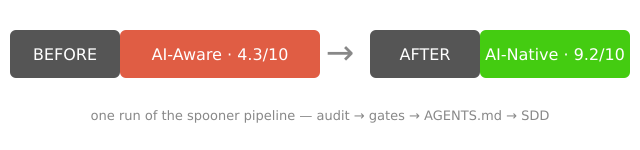

# Spooner

<p align="center">
  <a href="README.md">English</a> | <a href="README.zh-CN.md">简体中文</a>
</p>

> **让这个 git 仓库为 AI 做好准备**——AI coding agent 从第一次运行起就能在里面好好干活。检测它的 AI 编码就绪度、打出 10 分制的分数，然后就地改造：CI 门禁、AGENTS.md、spec 驱动工作流。每步可验证，永不破坏已有构建。

<p align="center">
  
  
  <a href="https://github.com/ZM-BAD/spooner/actions/workflows/ci.yml"></a>
  <a href="LICENSE"></a>
  <a href="assets/audit-report.md"></a>
</p>

一个 AI 原生（AI-Native）驱动的仓库，一般要具备完备的质量检测与 AI 引导设施，比如：**pre-commit 门禁**、真正会跑的 **lint / formatter 检查**、与本地门禁**一致的 CI**、告诉 agent 怎么干活的 **AGENTS.md**、**spec 驱动的契约**（SDD 模板）等等——未来涌现的同类质量检测设施，也会纳入 Spooner 的就绪度考核。

**Spooner 是一个按 [Agent Skills](https://agentskills.io/specification) 开放标准（SKILL.md）编写的、给 coding agent 用的 skill。名字来自《我，机器人》（2004）里的 Del Spooner 警探——他的左臂是机械臂，并很好地为他服务。Spooner 会评估你的仓库缺了上述哪些设施（AI 就绪度 /10），并渐进地为你补齐，防止它漂移。**

## 一次运行的效果

<p align="center">
  <a href="assets/audit-report.md"></a>
</p>

"改造前"是这个仓库的一份零状态副本——同样的代码，减去 spooner 会安装的一切（没有 AGENTS.md、没有 pre-commit/commitlint 门禁、没有漂移 gate、没有 SDD 工作流）。跑一次管线，就从 **4.3/10（AI-Aware）提升到 9.2/10（AI-Native）**——每个得分点都有证据支撑，而不是观点（[完整报告](assets/audit-report.md)）。

分数采用 10 分制，划分为五档：

| 档位        | 分数  | 含义                                                             |
| ----------- | ----- | ---------------------------------------------------------------- |
| AI-Native   | 9–10  | 开箱即用——有 AGENTS.md、真门禁、与本地钩子一致的 CI、无漂移      |
| AI-Friendly | 7–8.9 | 设施基本齐了，还剩一两个缺口（假 hook、CI 不一致、缺 AGENTS.md） |
| AI-Curious  | 5–6.9 | 有部分面向 AI 的配置，但不完整                                   |
| AI-Aware    | 3–4.9 | AI 能读懂，但没有为它做任何准备                                  |
| AI-Absent   | 0–2.9 | AI 连看懂都费劲——没有 README、没有结构、没有可追溯命令           |

## 工作流

| 命令        | 做什么                                                                                | 何时                 |
| ----------- | ------------------------------------------------------------------------------------- | -------------------- |
| `audit`     | 检测就绪度并评分（可重复，体检）                                                      | 任意仓库、任意时刻   |
| `transform` | 渐进化、可验证、可回滚的改造（按栈的 CI 门禁含 manifest 漂移 gate / AGENTS.md / SDD） | 一次性，手术         |
| `check`     | 持续检测漂移（可重复，有记录）                                                        | 每次 CI 运行         |
| `sync`      | 已装模板随工具版本重同步（版本感知、一键应用）                                        | 工具升级后           |
| `badge`     | 渲染就绪度徽章，匹配 README 现有徽章风格（5 种 shields 风格，链接审计报告）           | 改造之后、分数变动时 |

## 栈支持

| 栈                                             | detect + audit                                                                     | transform（门禁 + CI + AGENTS.md）       |
| ---------------------------------------------- | ---------------------------------------------------------------------------------- | ---------------------------------------- |
| node（含 React/Vue/Next）                      | ✅                                                                                 | ✅ `npm` 生命周期                        |
| python                                         | ✅                                                                                 | ✅ `python3 -m unittest discover`        |
| go                                             | ✅                                                                                 | ✅ `go build/test ./...`                 |
| java（Maven + Gradle）                         | ✅                                                                                 | ✅ `mvn -q -B test` / `gradle build`     |
| rust                                           | ✅                                                                                 | ✅ `cargo build/test`（fmt/clippy 门禁） |
| ruby / php / swift / dotnet / harmonyos        | ✅（audit 只低估不虚高）                                                           | ⚠️ 跨栈门禁 + 明确暂不支持提示           |
| apple / c-cpp / dart-flutter / unity（Tier 1） | ✅（canonical 生命周期信用：xcodebuild / cmake+ctest / flutter test+dart analyze） | ⚠️ 跨栈门禁 + 明确暂不支持提示           |
| zig                                            | ✅（zig build/test 生命周期信用）                                                  | ⚠️ 跨栈门禁 + 明确暂不支持提示           |

## 兼容性

10+ 主流 coding agent 全部原生支持 SKILL.md 标准，AGENTS.md 近乎全支持：

| Agent        | AGENTS.md                   | Skills 目录          |
| ------------ | --------------------------- | -------------------- |
| Claude Code  | 经 CLAUDE.md（软链）        | `.claude/skills/`    |
| OpenAI Codex | 原生                        | `.agents/skills/`    |
| OpenCode     | 原生                        | `.opencode/skills/`  |
| Qwen Code    | 原生                        | `.qwen/skills/`      |
| Kimi Code    | 原生                        | `.kimi-code/skills/` |
| CodeBuddy    | 兜底（主文件 CODEBUDDY.md） | `.codebuddy/skills/` |
| Trae         | 需开关                      | `.trae/skills/`      |
| Qoder        | 原生                        | `.qoder/skills/`     |
| ZCode        | 原生                        | `.zcode/skills/`     |
| Cursor       | 原生                        | `.cursor/skills/`    |
| VS Code      | 原生                        | `.github/skills/`    |

通用策略：**AGENTS.md** 管常驻事实（根目录，≤200 行）+ **SKILL.md** 管按需流程（标准格式）+ 每 agent 规则文件做单工具适配。

## 安装

skill 就是一个目录（`skills/spooner/`）——无构建步骤，只需 Node.js >= 22.18（脚本是 TypeScript，由 Node 原生 type-stripping 直接运行）。

### 一行安装（skills CLI）

```sh
npx skills add ZM-BAD/spooner
```

[skills CLI](https://github.com/vercel-labs/skills) 会把 `skills/spooner/` 复制到你的 agent 的 skills 目录，并从环境自动识别 agent。常用参数：

| 参数                     | 含义                                                  |
| ------------------------ | ----------------------------------------------------- |
| `-g` / `--global`        | 装到用户级 skills 目录（所有项目可用）                |
| `-a` / `--agent <agent>` | 指定目标 agent（`claude-code`、`codex`、`opencode`…） |
| `-s` / `--skill <name>`  | 只安装 spooner 这一个 skill                           |

### 手动安装（任意 agent）

把 `skills/spooner/` 目录复制到你的 agent 的 skills 目录（见上表）。用户级示例：

```sh
# Claude Code — 所有项目
mkdir -p ~/.claude/skills
cp -R skills/spooner ~/.claude/skills/

# OpenAI Codex — 所有项目
mkdir -p ~/.agents/skills
cp -R skills/spooner ~/.agents/skills/

# OpenCode — 所有项目
mkdir -p ~/.config/opencode/skills
cp -R skills/spooner ~/.config/opencode/skills/
```

想跟某个仓库共享：复制到上表对应的项目级路径（如 `.claude/skills/spooner/`）。

### 验证

在 agent 会话里列出技能（Claude Code 和 Codex 用 `/skills`），然后对任意仓库跑一次审计：

```sh
node skills/spooner/scripts/audit.ts
```

## 项目结构

```text
spooner/
├── AGENTS.md / CLAUDE.md   # Agent 契约（单一事实来源；CLAUDE.md 是软链）
├── README.md / README.zh-CN.md   # 中英双语文档
├── docs/                   # 本地内部设计档案（不入库，不公开）
├── specs/                  # SDD 工作契约（活文档：README + templates/ + <nnn>-<name>/）
├── skills/spooner/         # 可分发单元：SKILL.md + scripts/ + templates/
│   ├── SKILL.md            # Agent Skills 标准入口（name 与目录名一致）
│   ├── scripts/            # 零依赖脚本（TS 由 Node 原生运行）
│   └── templates/          # 产物模板（AGENTS.md 等）
└── .github/workflows/      # CI：pre-commit、typecheck、commitlint、SKILL.md 校验
```

## 开发

**SDD（Spec-Driven Development）：** 每个功能先写成 spec（`specs/<nnn>-<name>.md`，状态 `proposed → approved → in-progress → shipped`），按可独立验证的切片实现。模板：`specs/spec-template.md`。

```sh
npm run typecheck   # tsc --noEmit（TypeScript 6，零构建）
npm run lint:md     # markdownlint-cli2
npm run check       # typecheck + lint:md + tests
pre-commit install --hook-type commit-msg   # 每次 commit 强制 Conventional Commits
pre-commit run --all-files
node skills/spooner/scripts/detect.ts   # 切片 1：栈识别
```

**约束：** 只用 TypeScript 6（锁大版本——TS 7.1 前工具链仍需 6.0 API）、只用 erasable syntax（禁 `enum`/`namespace`）、脚本零依赖、Conventional Commits（commitlint 强制）。

## 分发

本 GitHub 仓库即为分发渠道——`npx skills add ZM-BAD/spooner` 直接安装。下一步计划：Claude Code 插件市场与社区注册表。

## 文档导航

| 文档                          | 内容                                           |
| ----------------------------- | ---------------------------------------------- |
| `AGENTS.md`                   | Agent 契约（单一事实来源；CLAUDE.md 是软链）   |
| `specs/README.md`             | SDD 工作流：状态、约定、两层结构               |
| `specs/ROADMAP.md`            | 规划索引：当前 / 下一阶段 / 远景 / 想法        |
| `specs/0001-m1-audit-core.md` | M1 audit 契约：评分矩阵、报告 schema、验收标准 |
| `skills/spooner/SKILL.md`     | 可分发 skill 入口                              |

## 贡献者

感谢试用反馈推动本项目改进的用户——每个版本的修复都来自他们提交的问题：

<a href="https://github.com/shellRaining"></a>

## 许可证

[MIT](LICENSE)
